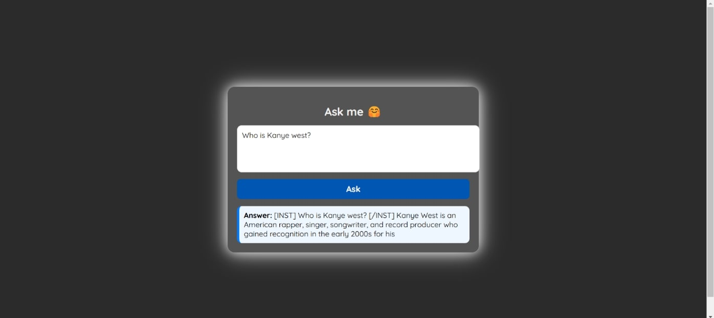
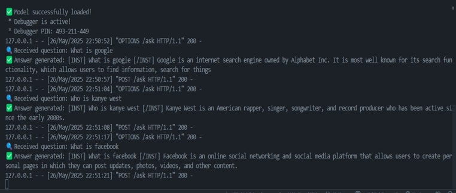
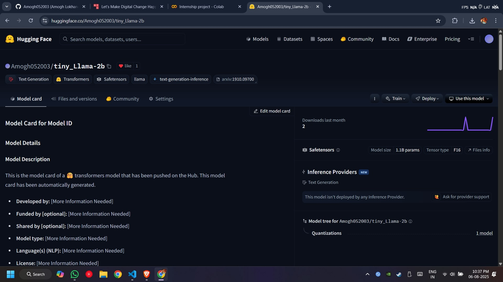

# QnA Bot using Transformers (LLaMA-2 + Flask + React)

This is a full-stack Question Answering (QnA) bot built using transformer-based models. The backend uses a fine-tuned **LLaMA-2 (7B)** model optimized with **QLoRA** for efficient deployment. The frontend is built using **React.js** and provides an intuitive interface for interacting with the bot.

The project demonstrates contextual language understanding and real-time response generation using modern NLP techniques.

---

## Features

- Fine-tuned transformer model (LLaMA-2) for contextual QnA
- Efficient memory usage through 4-bit quantization and LoRA fine-tuning
- Flask-based backend to serve model responses via API
- React.js frontend with interactive UI
- Model deployed and accessible via Hugging Face Hub

---

## Tech Stack

### Backend

- Python
- Flask
- Hugging Face Transformers
- BitsAndBytes (4-bit quantization)
- PEFT (QLoRA)

### Frontend

- React.js (with JSX)
- Axios (for API requests)
- Custom CSS

---

## Setup Instructions

### 1. Clone the Repository

```bash
git https://github.com/Amogh052003/QNA_chatbot
```

### 2. Run commands

**Run backend**:
pip install -r requirements.txt
python backend.py

**Run frontend:**

cd my-qna-
npm install
npm start

## Screenshots

**1. QnA Bot Web Interface**



**2. Backend Running (Flask Console)**



**3. Model Deployment on Hugging Face**


